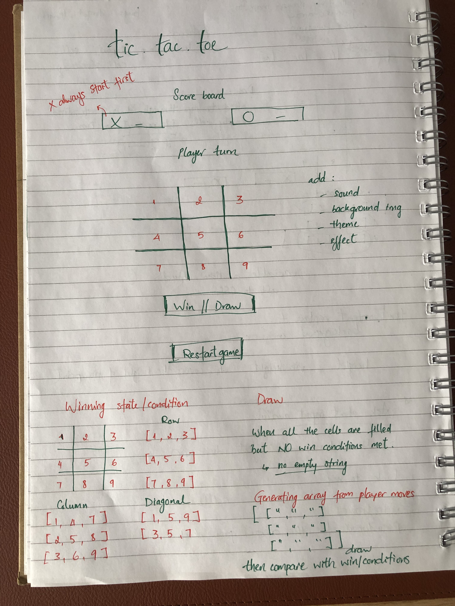

# Tic Tac Toe 
#### (Christmas version)

Tic Tac Toe is a two-player game played on a 3x3 grid. Players take turns marking 'X' and 'O' (in this case is the images of Santa and Reindeer) in empty cells. The goal is to get three of your marks in a row - horizontally, vertically, or diagonal - before your opponent does.

Tic Tac Toe may seems simple game, but its benefit lies in its ability to challenge the mind and encourage strategic thinking. It's a game where every move counts and offers endless opportunities for enjoyment and learning.

## 💻 [Click here](https://jaztruong.github.io/tic-tac-toe/) to see my live project!

## 📄 About

Begin by activating the "Music" for sound effects, then take turns selecting cells on the board as Reindeer or Santa. Continue playing until a winner determinded. Use the "Restart Game" button at the bottom for the next challenge.

This is the wireframe:

## Pseudocode

- drawing the wireframe
- working on html to set up game-frame
- set up js stucture
- styling with css
- refer to concept of guessing game to work out the way to select each grid and display X or O. 

### in html
- starting with title
- creating grid for game board
- creating buttons and message

### in JS
- game state (globals)

- caching DOM elements reference

- set up event listeners

- event handlers

- set up selected grid - grid change to X or O

- collecting player moves - push to array gameBoard in generateGameBoard function

- e.g: gameBoard = [
        0[0, 1, 2],
        1[0, 1, 2],
        2[0, 1, 2]
]

- check winning base on the 3 winning functions.
- checking ROWS - 3 options
- checking COLUMNS - 3 options
- checking DIAGONALS - 2 options

- update score board
    
- set up draw condition

- reset game
    
- other function
- sound effect 

### in CSS

- starting work on the grid first
- adding background image and work with the themes
- adding images for replacing X and O
- decorating title, buttons, scoreboards
- adding sound effect

## ✏️ Planning & Problem Solving

After the wireframe from paper, starting with html to create a frame for MVP

This is a longest state of the project. 
- Thinking and planing how to generate an array of player moves. 
- Compare the possible winning conditions with the array generated.
- These are the 2 most challenges. I refered back all the code-along in class, homework and Google resources to get these parts to work.

## 🚀 Cool tech

- Programming languages - html, css, javaScript
- Sound effect

## 😱 Bugs to fix 💩
- Some typos that make code not working. E.g: missing .length (dt helped to find the way to investigate the error message and fix the bug)
- Sound effect is not playing. 
- The grid in CSS keep stretching out when click on it.

## 😭 Lessons learnt
- Stick with the initial thought and develop form there. I was over thinking in some states (think of many options) and took a lot of time to start the work.

## ✅ Future features
- I will add animation effects into my game. E.g: when winning, all the winning boxes get crossed and appear winning message over the game board.
- The game can play with computer or AI (in the future)